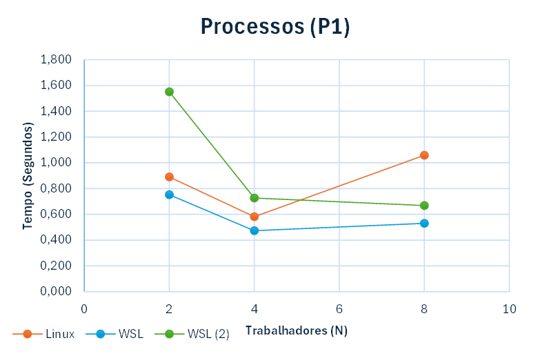
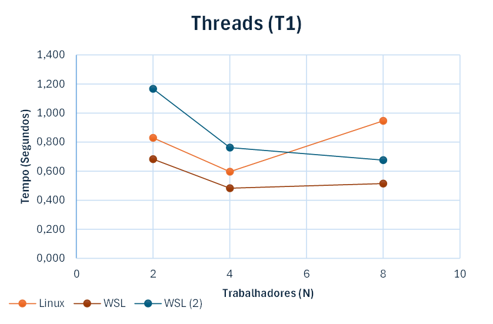
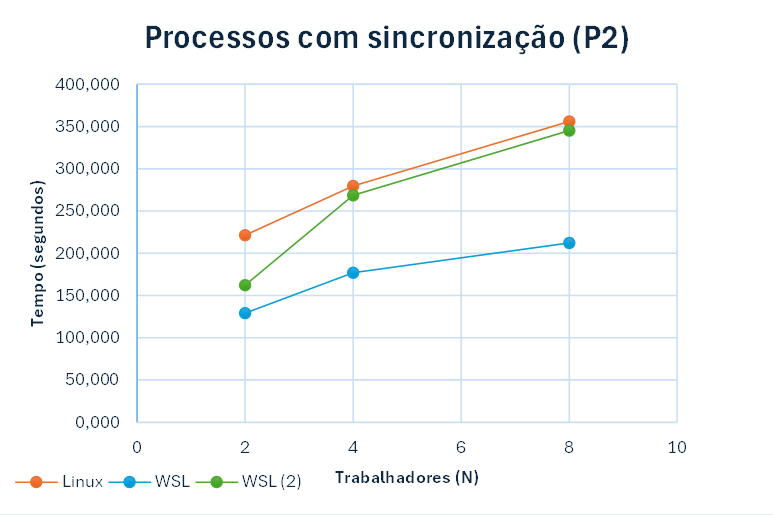
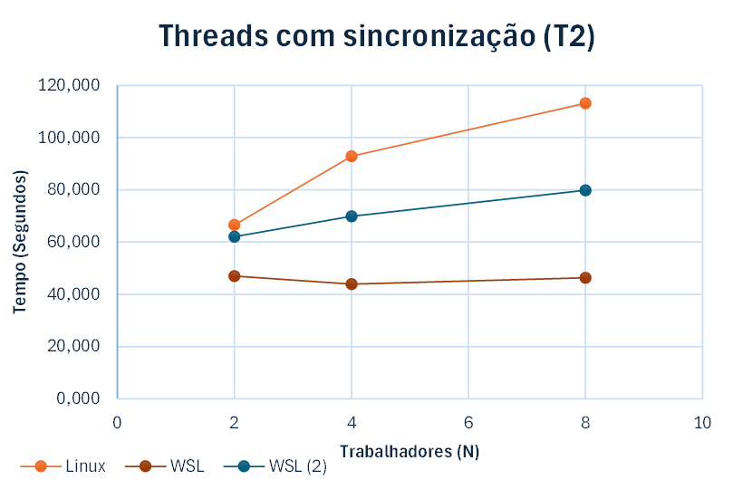

# O Duelo de Contextos (Processos vs. Threads) - Relatório
Porto Alegre – RS- Brasil 
  27 de abril 2026 

***Pontíficia Universidade Católica do Rio Grande do Sul*** 
### Integrantes
- Enzo Salatino Picoli
- Gustavo Burgie Ganzo Barcellos
- Renato Machado de Souza
- Vicenzo Martins Marramarco 

______________
# Instruções de uso
make: compila e executa o código de P1, P2, T1 e T2; cada um com N igual à 2, 4 e 8. (Os resultados de todas as execuções serão salvos no arquivo "resultados.csv")

make clean: exclui o executável e os resultados salvos.

# Introdução
Este relatório descreve o experimento exploratório comparando o overhead de criação, custo de comunicação e a consistência de dados entre Processos e Threads. O objetivo do trabalho é implementar um contador global até o valor de 1.000.000.000 através de compartilhamento de memória e distribuir o esforço entre as unidades de execução (trabalhadores), variando entre 2, 4 e 8 unidades, e executar quatro experimentos:

1. P1 & T1: Executar sem mecanismo de sincronização;
   - P1: uso de fork();
   - T1: uso de threads.
2. P2 & T2: Executar com mecanismo de sincronização.
   - P2: uso de fork() e semáforos para a sincronização;
   - T2: uso de threads e mutex para a sincronização.

Cada experimento foi salvo em um arquivo csv listando seu: modo de execução, tempo de execução, trabalhadores, sincronização e resultado final do contador.

Após a execução de tais experimentos, foram ser gerados gráficos e tabelas contendo os resultados obtidos em cada um, a fim de analisar o tempo, overheads e possíveis discrepâncias na soma final do contador sem sincronização. Além possibilitar a comparação entre os resultados de Processos e Threads.

Os experimentos foram executados nos hardwares descritos ao [fim do relatório](#assinaturas-de-hardware).

# Tabelas de tempo

Começando pelos experimentos T1 e P1, dentro do contexto dos seguintes hardwares, os valores finais dos contadores foram:

#### Linux Nativo (Gustavo)
| Modo     | Workers | Tempo (s) | Contador  |
| -------- | ------- | --------- | --------- |
| Processo | 2       | 0,891     | 502515113 |
| Processo | 4       | 0,583     | 265018899 |
| Processo | 8       | 1,058     | 258509813 |
| Thread   | 2       | 0,830     | 501786856 |
| Thread   | 4       | 0,597     | 266905048 |
| Thread   | 8       | 0,947     | 259630143 |

#### WSL - Ubuntu (Gustavo)
| Modo     | Workers | Tempo (s) | Contador  |
| -------- | ------- | --------- | --------- |
| Processo | 2       | 0,752     | 513616116 |
| Processo | 4       | 0,474     | 293385117 |
| Processo | 8       | 0,531     | 218581715 |
| Thread   | 2       | 0,683     | 520735268 |
| Thread   | 4       | 0,483     | 315689315 |
| Thread   | 8       | 0,515     | 222882439 |

#### WSL - Ubuntu (Renato)
| Modo     | Workers | Tempo (s) | Contador  |
| -------- | ------- | --------- | --------- |
| Processo | 2       | 1,552     | 583439198 |
| Processo | 4       | 0,727     | 313336578 |
| Processo | 8       | 0,668     | 258657047 |
| Thread   | 2       | 1,166     | 540894044 |
| Thread   | 4       | 0,762     | 329749789 |
| Thread   | 8       | 0,676     | 272181407 |


Com estes resultados, é possível perceber que a soma total do contador não conseguiu chegar ao número esperado, 1.000.000.000. Isso acontece por causa da falta de mecanismos de sincronização. Portanto, sempre que mais de um trabalhador tenta "adicionar" sua quantia à memória compartilhada ao mesmo tempo, eles não verificam se há algum outro tentando escrever e o último acaba sobrescrevendo o anterior. Em outras palavras, os trabalhadores estão sofrendo com a "Race Condition", já que a instrução de soma (counter++) não é atômica.

Já a diferença dos resultados finais entre cada máquina está ligada à variabilidade de núcleos e à arquitetura dos processadores. Logo, CPUs que possuem menos núcleos compartilham eles com mais trabalhadores, fazendo com que o sistema operacional tenha que gerenciar cada trabalhador para que revezem o mesmo núcleo através de preempção. Esse revezamento acontece através de troca de contexto, fazendo com que executem sequencialmente até ocorrer a troca. Isso essencialmente transforma boa parte da execução que seria paralela em sequencial, aumentando o tempo de execução mas diminuindo as colisões de acesso à memória. Portanto, é possível observar que o resultado se aproxima mais do esperado quanto mais tempo é gasto processando-o.

Agora, ao utilizarmos os mecanismos de sincronização com P2 e T2, isso é, o Mutex em threads e o Semáforo nos processos, obtemos o seguinte resultado:

#### Linux Nativo (Gustavo)
| Modo     | Workers | Tempo (s) | Contador   |
| -------- | ------- | --------- | ---------- |
| Processo | 2       | 221,343   | 1000000000 |
| Processo | 4       | 279,629   | 1000000000 |
| Processo | 8       | 356,094   | 1000000000 |
| Thread   | 2       | 66,537    | 1000000000 |
| Thread   | 4       | 92,847    | 1000000000 |
| Thread   | 8       | 113,202   | 1000000000 |

#### WSL - Ubuntu (Gustavo)
| Modo     | Workers | Tempo (s) | Contador   |
| -------- | ------- | --------- | ---------- |
| Processo | 2       | 129,282   | 1000000000 |
| Processo | 4       | 176,888   | 1000000000 |
| Processo | 8       | 212,249   | 1000000000 |
| Thread   | 2       | 46,985    | 1000000000 |
| Thread   | 4       | 43,960    | 1000000000 |
| Thread   | 8       | 46,283    | 1000000000 |

#### WSL - Ubuntu (Renato)
| Modo     | Workers | Tempo (s) | Contador   |
| -------- | ------- | --------- | ---------- |
| Processo | 2       | 162,299   | 1000000000 |
| Processo | 4       | 268,550   | 1000000000 |
| Processo | 8       | 345,130   | 1000000000 |
| Thread   | 2       | 62,091    | 1000000000 |
| Thread   | 4       | 69,875    | 1000000000 |
| Thread   | 8       | 79,877    | 1000000000 |


Ao observar os resultados da execução com sincronização é possível perceber que o contador conseguiu chegar ao resultado esperado de 1 bilhão, significando que os trabalhadores utilizaram com sucesso mecanismos de sincronização (mutex e semáforo), pois não houveram mais sobrescritas na memória durante a execução. Isso ocorreu pois tais mecanismos transformaram uma instrução que antes era não-atômica em uma Região Crítica, através de mutex_lock()/unlock e sem_wait/post, obrigando os trabalhadores a verificarem se o bloco de memória compartilhada está sendo utilizado antes de tentarem escrever nele. Essencialmente tornando aquela instrução atômica.

Essa mudança faz com que o contador sempre atinja o objetivo esperado, mesmo ocorrendo trocas de contexto, pois o incremento se tornou uma instrução atômica. Porém, a sincronização traz junto dela uma diminuição extremamente significativa em performance, aumentando no mínimo em mais de 100 vezes (+10000%) o tempo de execução com processos conforme os resultados obtidos. Por outro lado, a execução com threads aumentou no mínimo 40 vezes (+4000%) o tempo.

Assim, pode-se concluir que o uso de threads toma muito mais proveito de mecanismos de sincronização em relação à processos, nesse caso principalmente devido a compartilharem o mesmo processo, logo compartilhando a mesma página de memória, precisando salvar e carregar apenas a pilha e os registradores a cada troca de contexto.


# Gráficos

## Sem sincronização -
#### P1:


#### T1:


## Com sincronização -
#### P2:


#### T2:


# Assinaturas de Hardware
#### Executed on: **Gustavo: WSL - Ubuntu**
"WSL"
```
  Architecture:             x86_64
  CPU op-mode(s):         32-bit, 64-bit
  Address sizes:          39 bits physical, 48 bits virtual
  Byte Order:             Little Endian
CPU(s):                   20
  On-line CPU(s) list:    0-19
Vendor ID:                GenuineIntel
  Model name:             Intel(R) Core(TM) i9-10900K CPU @ 3.70GHz
    CPU family:           6
    Model:                165
    Thread(s) per core:   2
    Core(s) per socket:   10
    Socket(s):            1
    Stepping:             5
    BogoMIPS:             7391.99
    Flags:                fpu vme de pse tsc msr pae mce cx8 apic sep mtrr pge mca cmov pat pse36 clflush mmx fxsr sse s
                          se2 ss ht syscall nx pdpe1gb rdtscp lm constant_tsc arch_perfmon rep_good nopl xtopology cpuid
                           tsc_known_freq pni pclmulqdq ssse3 fma cx16 pdcm pcid sse4_1 sse4_2 movbe popcnt aes xsave av
                          x f16c rdrand hypervisor lahf_lm abm 3dnowprefetch ssbd ibrs ibpb stibp ibrs_enhanced fsgsbase
                           bmi1 avx2 smep bmi2 erms invpcid rdseed adx smap clflushopt xsaveopt xsavec xgetbv1 xsaves md
                          _clear flush_l1d arch_capabilities
Virtualization features:
  Hypervisor vendor:      Microsoft
  Virtualization type:    full
Caches (sum of all):
  L1d:                    320 KiB (10 instances)
  L1i:                    320 KiB (10 instances)
  L2:                     2.5 MiB (10 instances)
  L3:                     20 MiB (1 instance)
NUMA:
  NUMA node(s):           1
  NUMA node0 CPU(s):      0-19
Vulnerabilities:
  Gather data sampling:   Unknown: Dependent on hypervisor status
  Itlb multihit:          KVM: Mitigation: VMX unsupported
  L1tf:                   Not affected
  Mds:                    Not affected
  Meltdown:               Not affected
  Mmio stale data:        Vulnerable: Clear CPU buffers attempted, no microcode; SMT Host state unknown
  Reg file data sampling: Not affected
  Retbleed:               Mitigation; Enhanced IBRS
  Spec rstack overflow:   Not affected
  Spec store bypass:      Mitigation; Speculative Store Bypass disabled via prctl
  Spectre v1:             Mitigation; usercopy/swapgs barriers and __user pointer sanitization
  Spectre v2:             Mitigation; Enhanced / Automatic IBRS; IBPB conditional; RSB filling; PBRSB-eIBRS SW sequence;
                           BHI SW loop, KVM SW loop
  Srbds:                  Unknown: Dependent on hypervisor status
  Tsx async abort:        Not affected
```
#### Executed on: **Gustavo: Linux Ubuntu 24.04.1 LTS**
```
Architecture:                x86_64
  CPU op-mode(s):            32-bit, 64-bit
  Address sizes:             39 bits physical, 48 bits virtual
  Byte Order:                Little Endian
CPU(s):                      8
  On-line CPU(s) list:       0-7
Vendor ID:                   GenuineIntel
  Model name:                11th Gen Intel(R) Core(TM) i7-1165G7 @ 2.80GHz
    CPU family:              6
    Model:                   140
    Thread(s) per core:      2
    Core(s) per socket:      4
    Socket(s):               1
    Stepping:                1
    CPU(s) scaling MHz:      59%
    CPU max MHz:             4700,0000
    CPU min MHz:             400,0000
    BogoMIPS:                5606,40
    Flags:                   fpu vme de pse tsc msr pae mce cx8 apic sep mtrr pg
                             e mca cmov pat pse36 clflush dts acpi mmx fxsr sse 
                             sse2 ss ht tm pbe syscall nx pdpe1gb rdtscp lm cons
                             tant_tsc art arch_perfmon pebs bts rep_good nopl xt
                             opology nonstop_tsc cpuid aperfmperf tsc_known_freq
                              pni pclmulqdq dtes64 monitor ds_cpl vmx est tm2 ss
                             se3 sdbg fma cx16 xtpr pdcm pcid sse4_1 sse4_2 x2ap
                             ic movbe popcnt tsc_deadline_timer aes xsave avx f1
                             6c rdrand lahf_lm abm 3dnowprefetch cpuid_fault epb
                              cat_l2 cdp_l2 ssbd ibrs ibpb stibp ibrs_enhanced t
                             pr_shadow flexpriority ept vpid ept_ad fsgsbase tsc
                             _adjust bmi1 avx2 smep bmi2 erms invpcid rdt_a avx5
                             12f avx512dq rdseed adx smap avx512ifma clflushopt 
                             clwb intel_pt avx512cd sha_ni avx512bw avx512vl xsa
                             veopt xsavec xgetbv1 xsaves split_lock_detect user_
                             shstk dtherm ida arat pln pts hwp hwp_notify hwp_ac
                             t_window hwp_epp hwp_pkg_req vnmi avx512vbmi umip p
                             ku ospke avx512_vbmi2 gfni vaes vpclmulqdq avx512_v
                             nni avx512_bitalg avx512_vpopcntdq rdpid movdiri mo
                             vdir64b fsrm avx512_vp2intersect md_clear ibt flush
                             _l1d arch_capabilities
Virtualization features:     
  Virtualization:            VT-x
Caches (sum of all):         
  L1d:                       192 KiB (4 instances)
  L1i:                       128 KiB (4 instances)
  L2:                        5 MiB (4 instances)
  L3:                        12 MiB (1 instance)
NUMA:                        
  NUMA node(s):              1
  NUMA node0 CPU(s):         0-7
Vulnerabilities:             
  Gather data sampling:      Vulnerable
  Ghostwrite:                Not affected
  Indirect target selection: Mitigation; Aligned branch/return thunks
  Itlb multihit:             Not affected
  L1tf:                      Not affected
  Mds:                       Not affected
  Meltdown:                  Not affected
  Mmio stale data:           Not affected
  Old microcode:             Not affected
  Reg file data sampling:    Not affected
  Retbleed:                  Not affected
  Spec rstack overflow:      Not affected
  Spec store bypass:         Mitigation; Speculative Store Bypass disabled via p
                             rctl
  Spectre v1:                Mitigation; usercopy/swapgs barriers and __user poi
                             nter sanitization
  Spectre v2:                Mitigation; Enhanced / Automatic IBRS; IBPB conditi
                             onal; PBRSB-eIBRS SW sequence; BHI SW loop, KVM SW 
                             loop
  Srbds:                     Not affected
  Tsa:                       Not affected
  Tsx async abort:           Not affected
  Vmscape:                   Not affected
```

#### Executed on: **Renato: WSL Ubuntu**
"WSL (2)"
```
Architecture:                         x86_64
CPU op-mode(s):                       32-bit, 64-bit
Address sizes:                        39 bits physical, 48 bits virtual
Byte Order:                           Little Endian
CPU(s):                               12
On-line CPU(s) list:                  0-11
Vendor ID:                            GenuineIntel
Model name:                           11th Gen Intel(R) Core(TM) i5-11400H @ 2.70GHz
CPU family:                           6
Model:                                141
Thread(s) per core:                   2
Core(s) per socket:                   6
Socket(s):                            1
Stepping:                             1
BogoMIPS:                             5375.99
Flags:                                fpu vme de pse tsc msr pae mce cx8 apic sep mtrr pge mca cmov pat pse36 clflush mmx fxsr sse sse2 ss ht syscall nx pdpe1gb rdtscp lm constant_tsc arch_perfmon rep_good nopl xtopology tsc_reliable nonstop_tsc cpuid tsc_known_freq pni pclmulqdq vmx ssse3 fma cx16 pdcm pcid sse4_1 sse4_2 x2apic movbe popcnt tsc_deadline_timer aes xsave avx f16c rdrand hypervisor lahf_lm abm 3dnowprefetch ssbd ibrs ibpb stibp ibrs_enhanced tpr_shadow ept vpid ept_ad fsgsbase tsc_adjust bmi1 avx2 smep bmi2 erms invpcid avx512f avx512dq rdseed adx smap avx512ifma clflushopt clwb avx512cd sha_ni avx512bw avx512vl xsaveopt xsavec xgetbv1 xsaves vnmi avx512vbmi umip avx512_vbmi2 gfni vaes vpclmulqdq avx512_vnni avx512_bitalg avx512_vpopcntdq rdpid movdiri movdir64b fsrm avx512_vp2intersect md_clear flush_l1d arch_capabilities
Virtualization:                       VT-x
Hypervisor vendor:                    Microsoft
Virtualization type:                  full
L1d cache:                            288 KiB (6 instances)
L1i cache:                            192 KiB (6 instances)
L2 cache:                             7.5 MiB (6 instances)
L3 cache:                             12 MiB (1 instance)
NUMA node(s):                         1
NUMA node0 CPU(s):                    0-11
Vulnerability Gather data sampling:   Not affected
Vulnerability Itlb multihit:          Not affected
Vulnerability L1tf:                   Not affected
Vulnerability Mds:                    Not affected
Vulnerability Meltdown:               Not affected
Vulnerability Mmio stale data:        Not affected
Vulnerability Reg file data sampling: Not affected
Vulnerability Retbleed:               Mitigation; Enhanced IBRS
Vulnerability Spec rstack overflow:   Not affected
Vulnerability Spec store bypass:      Mitigation; Speculative Store Bypass disabled via prctl
Vulnerability Spectre v1:             Mitigation; usercopy/swapgs barriers and __user pointer sanitization
Vulnerability Spectre v2:             Mitigation; Enhanced / Automatic IBRS; IBPB conditional; RSB filling; PBRSB-eIBRS SW sequence; BHI SW loop, KVM SW loop
Vulnerability Srbds:                  Not affected
Vulnerability Tsx async abort:        Not affected
```